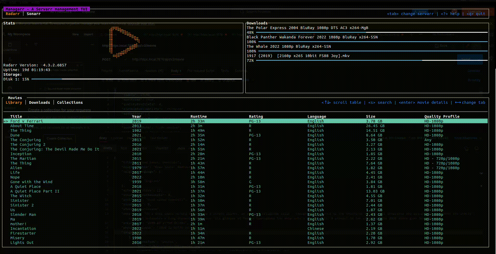

# managarr - A TUI to manage your Servarrs
Managarr is a TUI to help you manage your HTPC (Home Theater PC). Built with love in Rust!



 [Wekan Board](https://wekan.alextusa.com/b/NPSm8BkivuAKy2HXf/managarr)

## What Servarrs are supported?

-  [Radarr](https://wiki.servarr.com/radarr)
-  [Sonarr](https://wiki.servarr.com/en/sonarr)
-  [Readarr](https://wiki.servarr.com/en/readarr)
-  [Lidarr](https://wiki.servarr.com/en/lidarr)
-  [Prowlarr](https://wiki.servarr.com/en/prowlarr)
-  [Whisparr](https://wiki.servarr.com/whisparr)
-  [Bazarr](https://www.bazarr.media/)
-  [Tautulli](https://tautulli.com/)

# Configuration 
Managarr assumes reasonable defaults to connect to each service (i.e. Radarr is on localhost:7878), 
but all servers will require you to input the API token. 

The configuration file is located somewhere different for each OS
### Linux
```
$HOME/.config/managarr/config.yml
```

### Mac
```
$HOME/Library/Application Support/managarr/config.yml
```

### Windows
```
%APPDATA%/Roaming/managarr/config.yml
```

### Example Configuration:
```yaml
radarr:
  host: 127.0.0.1
  port: 7878
  api_token: someApiToken1234567890
sonarr:
  host: 127.0.0.1
  port: 8989
  api_token: someApiToken1234567890
readarr:
  host: 127.0.0.1
  port: 8787
  api_token: someApiToken1234567890
lidarr:
  host: 127.0.0.1
  port: 8686
  api_token: someApiToken1234567890
whisparr:
  host: 127.0.0.1
  port: 6969
  api_token: someApiToken1234567890
bazarr:
  host: 127.0.0.1
  port: 6767
  api_token: someApiToken1234567890
prowlarr:
  host: 127.0.0.1
  port: 9696
  api_token: someApiToken1234567890
tautulli:
  host: 127.0.0.1
  port: 8181
  api_token: someApiToken1234567890
```

## Features

### Radarr

- [x] View your library, downloads, collections
- [x] View details of a specific movie including description, history, downloaded file info, or the credits
- [x] View details of any collection and the movies in them
- [x] Search your library or collections
- [x] Add or delete movies and downloads
- [x] Trigger automatic searches for movies
- [x] Trigger refresh and disk scan for movies, downloads, and collections
- [x] Manually search for movies
- [x] Edit your movies and collections
- [x] Manage your tags
- [ ] Manage your quality profiles
- [ ] Manage your quality definitions
- [ ] Manage your indexers

### Sonarr
- [ ] Support for Sonarr

### Readarr

- [ ] Support for Readarr

### Lidarr

- [ ] Support for Lidarr

### Whisparr

- [ ] Support for Whisparr

### Bazarr

- [ ] Support for Bazarr

### Prowlarr

- [ ] Support for Prowlarr

### Tautulli

- [ ] Support for Tautulli

## Dependencies
* [tui-rs](https://github.com/fdehau/tui-rs)
* [crossterm](https://github.com/crossterm-rs/crossterm)
* [clap](https://github.com/clap-rs/clap)
* [tokio](https://github.com/tokio-rs/tokio)
* [serde](https://github.com/serde-rs/serde)
* [reqwest](https://github.com/seanmonstar/reqwest)

## Servarr Requirements
* [Radarr >= v3](https://radarr.video/docs/api/)
* [Sonarr >= v3](https://sonarr.tv/docs/api/)
* [Readarr v1](https://readarr.com/docs/api/)
* [Lidarr v1](https://lidarr.audio/docs/api/)
* [Whisparr >= v3](https://whisparr.com/docs/api/)
* [Prowlarr v1](https://prowlarr.com/docs/api/)
* [Bazarr v1.1.4](http://localhost:6767/api)
* [Tautulli >= v2](https://github.com/Tautulli/Tautulli/wiki/Tautulli-API-Reference)