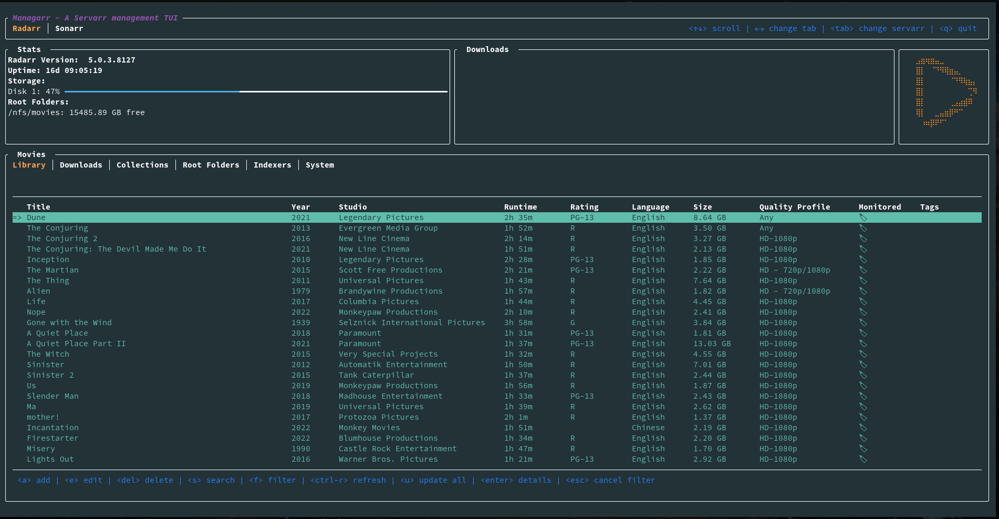
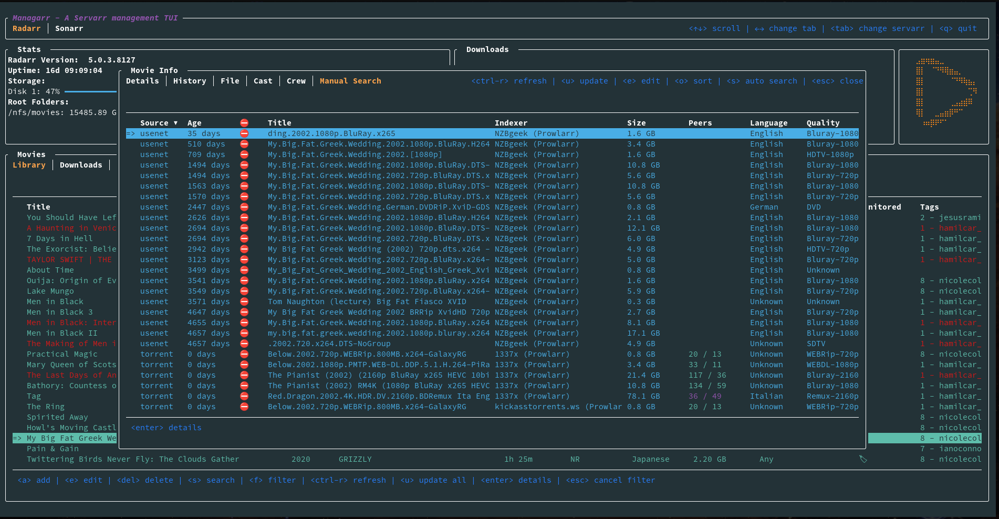
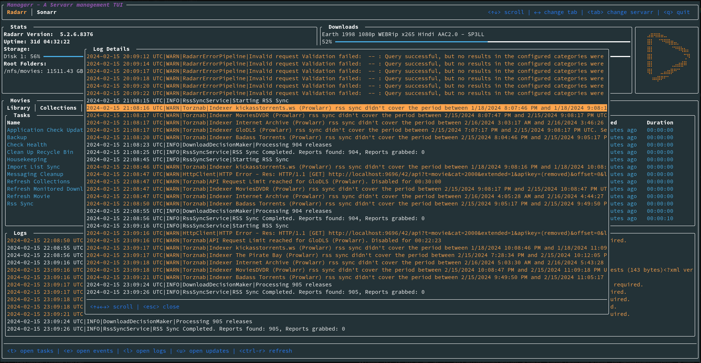
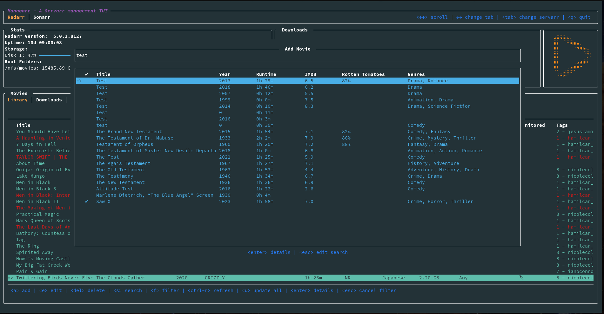
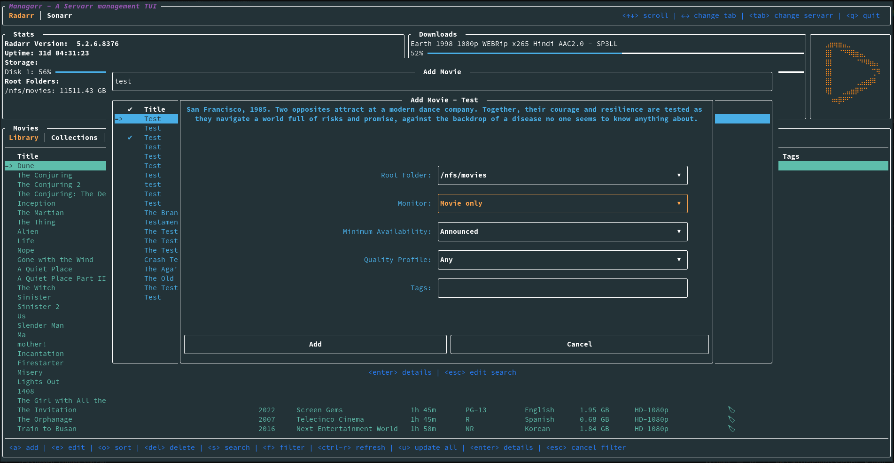
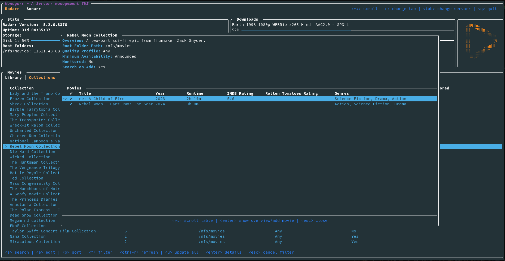
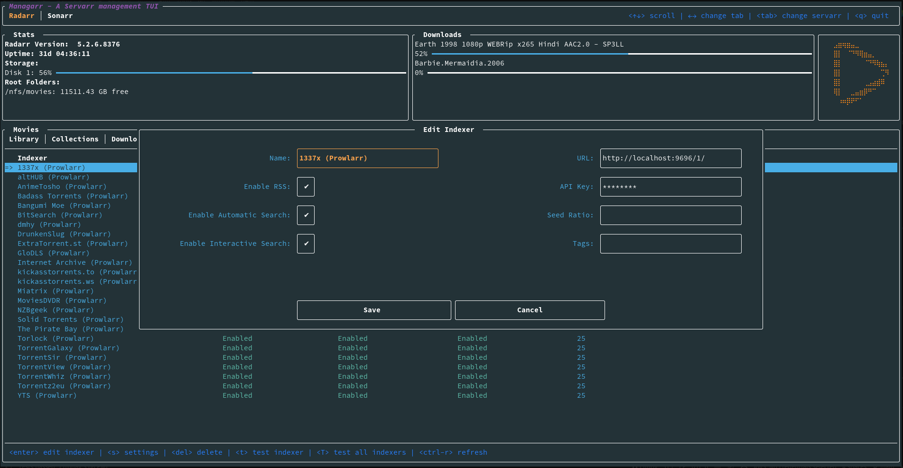

# managarr - A TUI and CLI to manage your Servarrs


[](https://crates.io/crates/managarr)

[](https://codecov.io/gh/Dark-Alex-17/managarr)
[](https://github.com/Dark-Alex-17/managarr/releases)


Managarr is a TUI and CLI to help you manage your HTPC (Home Theater PC). Built with 🤎 in Rust!



## What Servarrs are supported?

- [x]  [Radarr](https://wiki.servarr.com/radarr)
- [ ]  [Sonarr](https://wiki.servarr.com/en/sonarr)
- [ ]  [Readarr](https://wiki.servarr.com/en/readarr)
- [ ]  [Lidarr](https://wiki.servarr.com/en/lidarr)
- [ ]  [Prowlarr](https://wiki.servarr.com/en/prowlarr)
- [ ]  [Whisparr](https://wiki.servarr.com/whisparr)
- [ ]  [Bazarr](https://www.bazarr.media/)
- [ ]  [Tautulli](https://tautulli.com/)

## Try Before You Buy
To try out Managarr before linking it to your HTPC, you can use the purpose built [managarr-demo](https://github.com/Dark-Alex-17/managarr-demo) repository.
Simply run the following command to start a demo:

```shell
curl https://raw.githubusercontent.com/Dark-Alex-17/managarr-demo/main/managarr-demo.sh > /tmp/managarr-demo.sh && bash /tmp/managarr-demo.sh
```

## Installation
### Cargo
If you have Cargo installed, then you can install Managarr from Crates.io:

```shell
cargo install managarr

# If you encounter issues installing, try installing with '--locked'
cargo install --locked managarr
```

### Docker
Run Managarr as a docker container by mounting your `config.yml` file to `/root/.config/managarr/config.yml`. For example:
```shell
docker run --rm -it -v ~/.config/managarr:/root/.config/managarr darkalex17/managarr
```

You can also clone this repo and run `make docker` to build a docker image locally and run it using the above command.

## Features

### Radarr

- [x] View your library, downloads, collections, and blocklist
- [x] View details of a specific movie including description, history, downloaded file info, or the credits
- [x] View details of any collection and the movies in them
- [x] View your host and security configs from the CLI to programmatically fetch the API token, among other settings
- [x] Search your library or collections
- [x] Add movies to your library
- [x] Delete movies, downloads, and indexers
- [x] Trigger automatic searches for movies
- [x] Trigger refresh and disk scan for movies, downloads, and collections
- [x] Manually search for movies
- [x] Edit your movies, collections, and indexers
- [x] Manage your tags
- [x] Manage your root folders
- [x] Manage your blocklist
- [x] View and browse logs, tasks, events queues, and updates
- [x] Manually trigger scheduled tasks

### Sonarr
- [ ] Support for Sonarr

### Readarr

- [ ] Support for Readarr

### Lidarr

- [ ] Support for Lidarr

### Whisparr

- [ ] Support for Whisparr

### Bazarr

- [ ] Support for Bazarr

### Prowlarr

- [ ] Support for Prowlarr

### Tautulli

- [ ] Support for Tautulli

### The Managarr CLI
Managarr can be used in one of two ways: As a TUI, or as a CLI for managing your Servarrs. 

All management features available in the TUI are also available in the CLI. However, the CLI is
equipped with additional features to allow for more advanced usage and automation.

The CLI can be helpful for automating tasks or for use in scripts. For example, you can use the CLI to trigger a search for a movie, or to add a movie to your library.

To see all available commands, simply run `managarr --help`:

```shell
$ managarr --help
managarr 0.1.3
Alex Clarke <alex.j.tusa@gmail.com>

A TUI and CLI to manage your Servarrs

Usage: managarr [OPTIONS] [COMMAND]

Commands:
  radarr       Commands for manging your Radarr instance
  completions  Generate shell completions for the Managarr CLI
  help         Print this message or the help of the given subcommand(s)

Options:
      --config <CONFIG>               The Managarr configuration file to use
      --disable-terminal-size-checks  Disable the terminal size checks
  -h, --help                          Print help
  -V, --version                       Print version
```

All subcommands also have detailed help menus to show you how to use them. For example, to see all available commands for Radarr, you would run:

```shell
$ managarr radarr --help
Commands for manging your Radarr instance

Usage: managarr radarr [OPTIONS] <COMMAND>

Commands:
  add                       Commands to add or create new resources within your Radarr instance
  delete                    Commands to delete resources from your Radarr instance
  edit                      Commands to edit resources in your Radarr instance
  get                       Commands to fetch details of the resources in your Radarr instance
  list                      Commands to list attributes from your Radarr instance
  refresh                   Commands to refresh the data in your Radarr instance
  clear-blocklist           Clear the blocklist
  download-release          Manually download the given release for the specified movie ID
  manual-search             Trigger a manual search of releases for the movie with the given ID
  search-new-movie          Search for a new film to add to Radarr
  start-task                Start the specified Radarr task
  test-indexer              Test the indexer with the given ID. Note that a successful test returns an empty JSON body; i.e. '{}'
  test-all-indexers         Test all indexers
  trigger-automatic-search  Trigger an automatic search for the movie with the specified ID
  help                      Print this message or the help of the given subcommand(s)

Options:
      --config <CONFIG>               The Managarr configuration file to use
      --disable-terminal-size-checks  Disable the terminal size checks
  -h, --help                          Print help
```

**Pro Tip:** The CLI is even more powerful and useful when used in conjunction with the `jq` CLI tool. This allows you to parse the JSON response from the Managarr CLI and use it in your scripts; For example, to extract the `movieId` of the movie "Ad Astra", you would run:

```shell
$ managarr radarr list movies | jq '.[] | select(.title == "Ad Astra") | .id'
277
```

# Configuration
Managarr assumes reasonable defaults to connect to each service (i.e. Radarr is on localhost:7878),
but all servers will require you to input the API token.

The configuration file is located somewhere different for each OS

### Linux
```
$HOME/.config/managarr/config.yml
```

### Mac
```
$HOME/Library/Application Support/managarr/config.yml
```

### Windows
```
%APPDATA%/Roaming/managarr/config.yml
```

## Specify Which Configuration File to Use
It can sometimes be useful to specify the configuration file you wish to use. This is useful in cases
where you may have more than one instance of a given Servarr running. Thus, you can specify the 
config file using the `--config` flag:

```shell
managarr --config /path/to/config.yml
```

### Example Configuration:
```yaml
radarr:
  host: 127.0.0.1
  port: 7878
  api_token: someApiToken1234567890
  use_ssl: true
  ssl_cert_path: /path/to/radarr.crt
sonarr:
  host: 127.0.0.1
  port: 8989
  api_token: someApiToken1234567890
readarr:
  host: 127.0.0.1
  port: 8787
  api_token: someApiToken1234567890
  use_ssl: false
lidarr:
  host: 127.0.0.1
  port: 8686
  api_token: someApiToken1234567890
  use_ssl: false
whisparr:
  host: 127.0.0.1
  port: 6969
  api_token: someApiToken1234567890
  use_ssl: false
bazarr:
  host: 127.0.0.1
  port: 6767
  api_token: someApiToken1234567890
  use_ssl: false
prowlarr:
  host: 127.0.0.1
  port: 9696
  api_token: someApiToken1234567890
  use_ssl: false
tautulli:
  host: 127.0.0.1
  port: 8181
  api_token: someApiToken1234567890
  use_ssl: false
```

## Track My Progress for the Beta release (With Sonarr Support!)
Progress for the beta release can be followed on my [Wekan Board](https://wekan.alexjclarke.com/b/dHoGjBb44MHM9HSv4/managarr)
with all items tagged `Beta`.

## Screenshots









## Dependencies
* [ratatui](https://github.com/tui-rs-revival/ratatui)
* [crossterm](https://github.com/crossterm-rs/crossterm)
* [clap](https://github.com/clap-rs/clap)
* [tokio](https://github.com/tokio-rs/tokio)
* [serde](https://github.com/serde-rs/serde)
* [reqwest](https://github.com/seanmonstar/reqwest)

## Servarr Requirements
* [Radarr >= 5.3.6.8612](https://radarr.video/docs/api/)
* [Sonarr >= v3](https://sonarr.tv/docs/api/)
* [Readarr v1](https://readarr.com/docs/api/)
* [Lidarr v1](https://lidarr.audio/docs/api/)
* [Whisparr >= v3](https://whisparr.com/docs/api/)
* [Prowlarr v1](https://prowlarr.com/docs/api/)
* [Bazarr v1.1.4](http://localhost:6767/api)
* [Tautulli >= v2](https://github.com/Tautulli/Tautulli/wiki/Tautulli-API-Reference)

## Creator
* [Alex Clarke](https://github.com/Dark-Alex-17)
