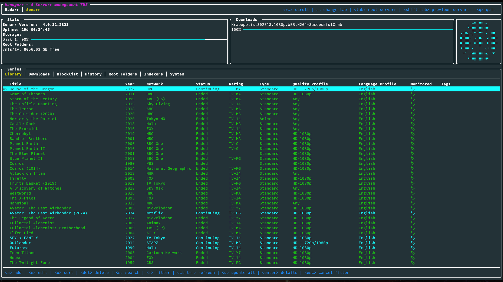
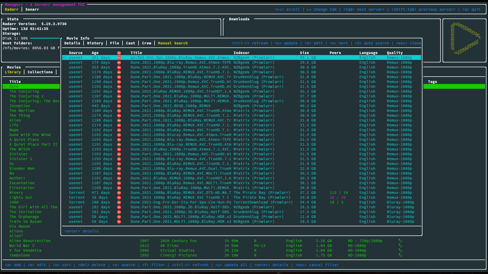

# managarr - A TUI and CLI to manage your Servarrs


[](https://crates.io/crates/managarr)

[](https://codecov.io/gh/Dark-Alex-17/managarr)

[](https://github.com/Dark-Alex-17/managarr/releases)

[](https://matrix.to/#/#managarr:matrix.org)


Managarr is a TUI and CLI to help you manage your HTPC (Home Theater PC). Built with 🤎 in Rust!



## What Servarrs are supported?

- [x]  [Radarr](https://wiki.servarr.com/radarr)
- [x]  [Sonarr](https://wiki.servarr.com/en/sonarr)
- [ ]  [Readarr](https://wiki.servarr.com/en/readarr)
- [ ]  [Lidarr](https://wiki.servarr.com/en/lidarr)
- [ ]  [Prowlarr](https://wiki.servarr.com/en/prowlarr)
- [ ]  [Whisparr](https://wiki.servarr.com/whisparr)
- [ ]  [Bazarr](https://www.bazarr.media/)
- [ ]  [Tautulli](https://tautulli.com/)

## Try Before You Buy
To try out Managarr before linking it to your HTPC, you can use the purpose built [managarr-demo](https://github.com/Dark-Alex-17/managarr-demo) repository.
Simply run the following command to start a demo:

```shell
curl https://raw.githubusercontent.com/Dark-Alex-17/managarr-demo/main/managarr-demo.sh > /tmp/managarr-demo.sh && bash /tmp/managarr-demo.sh
```

Alternatively, you can try out the demo container without downloading anything by visiting the [Managarr Demo site](https://managarr-demo.alexjclarke.com).

## Installation

### Cargo
If you have Cargo installed, then you can install Managarr from Crates.io:

```shell
cargo install managarr

# If you encounter issues installing, try installing with '--locked'
cargo install --locked managarr
```

### Docker
Run Managarr as a docker container by mounting your `config.yml` file to `/root/.config/managarr/config.yml`. For example:
```shell
docker run --rm -it -v /home/aclarke/.config/managarr/config.yml:/root/.config/managarr/config.yml darkalex17/managarr:latest
```

You can also clone this repo and run `make docker` to build a docker image locally and run it using the above command.

Please note that you will need to create and popular your configuration file first before starting the container. Otherwise, the container will fail to start.

**Note:** If you run into errors using relative file paths when mounting the volume with the configuration file, try using an absolute path.

### Homebrew (Mac and Linux)
To install Managarr from Homebrew, install the Managarr tap and then you'll be able to install Managarr:

```shell
brew tap Dark-Alex-17/managarr
brew install managarr

# If you need to be more specific, use the following:
brew install Dark-Alex-17/managarr/managarr
```

To upgrade to a newer version of Managarr:
```shell
brew upgrade managarr
```

### Nix (Externally Maintained)
To install Managarr on NixOS, you can use the following command:

```shell
nix-env --install managarr

# Alternatively, for non-NixOS users, you can spawn a temporary shell with Managarr available like so:
nix-shell -p managarr
```

### Chocolatey (Windows)
The Managarr Chocolatey package is located [here](https://community.chocolatey.org/packages/managarr). Please note that validation
of Chocolatey packages take quite some time, and thus the package may not be available immediately after a new release.

```powershell
choco install managarr

# Some newer releases may require a version number, so you can specify it like so:
choco install managarr --version=0.5.0
```

To upgrade to the latest and greatest version of Managarr:
```powershell
choco upgrade managarr

# To upgrade to a specific version:
choco upgrade managarr --version=0.5.0
```

### Manual
Binaries are available on the [releases](https://github.com/Dark-Alex-17/managarr/releases) page for the following platforms:

| Platform       | Architecture(s)            |
|----------------|----------------------------|
| macOS          | x86_64, arm64              |
| Linux GNU/MUSL | x86_64,armv6,armv7,aarch64 |
| Windows        | x86_64,aarch64             |

#### Windows Instructions
To use a binary from the releases page on Windows, do the following:

1. Download the latest binary [binary](https://github.com/Dark-Alex-17/managarr/releases) for your OS.
2. Use 7-Zip or TarTool to unpack the Tar file.
3. Run the executable `managarr.exe`!

#### Linux/MacOS Instructions
To use a binary from the releases page on Linux/MacOS, do the following:

1. Download the latest binary [binary](https://github.com/Dark-Alex-17/managarr/releases) for your OS.
2. `cd` to the directory where you downloaded the binary.
3. Extract the binary with `tar -C /usr/local/bin -xzf managarr-<arch>.tar.gz` (NB: This may require `sudo`)
4. Now you can run `managarr`!

## Features
Key:

| Symbol | Status    |
|--------|-----------|
| ✅      | Supported |
| ❌      | Missing   |
| 🕒     | Planned   |
| 🚫     | Won't Add |

### Radarr

| TUI | CLI | Feature                                                                                                        |
|-----|-----|----------------------------------------------------------------------------------------------------------------|
| ✅   | ✅   | View your library, downloads, collections, and blocklist                                                       |
| ✅   | ✅   | View details of a specific movie including description, history, downloaded file info, or the credits          |
| ✅   | ✅   | View details of any collection and the movies in them                                                          |
| 🚫  | ✅   | View your host and security configs from the CLI to programmatically fetch the API token, among other settings |
| ✅   | ✅   | Search your library or collections                                                                             |
| ✅   | ✅   | Add movies to your library                                                                                     |
| ✅   | ✅   | Delete movies, downloads, and indexers                                                                         |
| ✅   | ✅   | Trigger automatic searches for movies                                                                          |
| ✅   | ✅   | Trigger refresh and disk scan for movies, downloads, and collections                                           |
| ✅   | ✅   | Manually search for movies                                                                                     |
| ✅   | ✅   | Edit your movies, collections, and indexers                                                                    |
| ✅   | ✅   | Manage your tags                                                                                               |
| ✅   | ✅   | Manage your root folders                                                                                       |
| ✅   | ✅   | Manage your blocklist                                                                                          |
| ✅   | ✅   | View and browse logs, tasks, events queues, and updates                                                        |
| ✅   | ✅   | Manually trigger scheduled tasks                                                                               |

### Sonarr

| TUI | CLI | Feature                                                                                                            |
|-----|-----|--------------------------------------------------------------------------------------------------------------------|
| ✅  | ✅   | View your library, downloads, blocklist, episodes                                                                  |
| ✅  | ✅   | View details of a specific series, or episode including description, history, downloaded file info, or the credits |
| 🚫  | ✅   | View your host and security configs from the CLI to programmatically fetch the API token, among other settings     |
| ✅  | ✅   | Search your library                                                                                                |
| ✅  | ✅   | Add series to your library                                                                                         |
| ✅  | ✅   | Delete series, downloads, indexers, root folders, and episode files                                                |
| ✅  | ✅   | Trigger automatic searches for series, seasons, or episodes                                                        |
| ✅  | ✅   | Trigger refresh and disk scan for series and downloads                                                             |
| ✅  | ✅   | Manually search for series, seasons, or episodes                                                                   |
| ✅  | ✅   | Edit your series and indexers                                                                                      |
| ✅  | ✅   | Manage your tags                                                                                                   |
| ✅  | ✅   | Manage your root folders                                                                                           |
| ✅  | ✅   | Manage your blocklist                                                                                              |
| ✅  | ✅   | View and browse logs, tasks, events queues, and updates                                                            |
| ✅  | ✅   | Manually trigger scheduled tasks                                                                                   |

### Readarr

- [ ] Support for Readarr

### Lidarr

- [ ] Support for Lidarr

### Whisparr

- [ ] Support for Whisparr

### Bazarr

- [ ] Support for Bazarr

### Prowlarr

- [ ] Support for Prowlarr

### Tautulli

- [ ] Support for Tautulli

### The Managarr CLI
Managarr can be used in one of two ways: As a TUI, or as a CLI for managing your Servarrs. 

All management features available in the TUI are also available in the CLI. However, the CLI is
equipped with additional features to allow for more advanced usage and automation.

The CLI can be helpful for automating tasks or for use in scripts. For example, you can use the CLI to trigger a search for a movie, or to add a movie to your Radarr library.

To see all available commands, simply run `managarr --help`:

```shell
$ managarr --help
managarr 0.5.0
Alex Clarke <alex.j.tusa@gmail.com>

A TUI and CLI to manage your Servarrs

Usage: managarr [OPTIONS] [COMMAND]

Commands:
  radarr       Commands for manging your Radarr instance
  sonarr       Commands for manging your Sonarr instance
  completions  Generate shell completions for the Managarr CLI
  tail-logs    Tail Managarr logs
  help         Print this message or the help of the given subcommand(s)

Options:
      --disable-spinner              Disable the spinner (can sometimes make parsing output challenging) [env: MANAGARR_DISABLE_SPINNER=]
      --config-file <CONFIG_FILE>    The Managarr configuration file to use [env: MANAGARR_CONFIG_FILE=]
      --servarr-name <SERVARR_NAME>  For multi-instance configurations, you need to specify the name of the instance configuration that you want to use.
                                         This is useful when you have multiple instances of the same Servarr defined in your config file.
                                         By default, if left empty, the first configured Servarr instance listed in the config file will be used.
  -h, --help                         Print help
  -V, --version                      Print version
```

All subcommands also have detailed help menus to show you how to use them. For example, to see all available commands for Sonarr, you would run:

```shell
$ managarr sonarr --help
Commands for manging your Sonarr instance

Usage: managarr sonarr [OPTIONS] <COMMAND>

Commands:
  add                          Commands to add or create new resources within your Sonarr instance
  delete                       Commands to delete resources from your Sonarr instance
  edit                         Commands to edit resources in your Sonarr instance
  get                          Commands to fetch details of the resources in your Sonarr instance
  download                     Commands to download releases in your Sonarr instance
  list                         Commands to list attributes from your Sonarr instance
  refresh                      Commands to refresh the data in your Sonarr instance
  manual-search                Commands to manually search for releases
  trigger-automatic-search     Commands to trigger automatic searches for releases of different resources in your Sonarr instance
  clear-blocklist              Clear the blocklist
  mark-history-item-as-failed  Mark the Sonarr history item with the given ID as 'failed'
  search-new-series            Search for a new series to add to Sonarr
  start-task                   Start the specified Sonarr task
  test-indexer                 Test the indexer with the given ID. Note that a successful test returns an empty JSON body; i.e. '{}'
  test-all-indexers            Test all Sonarr indexers
  toggle-episode-monitoring    Toggle monitoring for the specified episode
  toggle-season-monitoring     Toggle monitoring for the specified season that corresponds to the specified series ID
  help                         Print this message or the help of the given subcommand(s)

Options:
      --disable-spinner  Disable the spinner (can sometimes make parsing output challenging) [env: MANAGARR_DISABLE_SPINNER=]
      --config <CONFIG>  The Managarr configuration file to use [env: MANAGARR_CONFIG_FILE=]
  -h, --help             Print help
```

**Pro Tip:** The CLI is even more powerful and useful when used in conjunction with the `jq` CLI tool. This allows you to parse the JSON response from the Managarr CLI and use it in your scripts; For example, to extract the `movieId` of the movie "Ad Astra", you would run:

```shell
$ managarr radarr list movies | jq '.[] | select(.title == "Ad Astra") | .id'
277
```

# Configuration
Managarr assumes reasonable defaults to connect to each service (i.e. Radarr is on localhost:7878),
but all servers will require you to input the API token.

The configuration file is located somewhere different for each OS.

### Linux
```
$HOME/.config/managarr/config.yml
```

### Mac
```
$HOME/Library/Application Support/managarr/config.yml
```

### Windows
```
%APPDATA%/Roaming/managarr/config.yml
```

## Specify Which Configuration File to Use
It can sometimes be useful to specify the configuration file you wish to use. This is useful in cases
where you may have more than one instance of a given Servarr running. Thus, you can specify the 
config file using the `--config` flag:

```shell
managarr --config-file /path/to/config.yml
```

### Example Configuration:
```yaml
radarr:
  - host: 192.168.0.78
    port: 7878
    api_token: someApiToken1234567890
    ssl_cert_path: /path/to/radarr.crt # Required to enable SSL
sonarr:
  - uri: http://htpc.local/sonarr # Example of using the 'uri' key instead of 'host' and 'port'
    api_token: someApiToken1234567890
    
  - name: Anime Sonarr # An example of a custom name for a secondary Sonarr instance
    host: 192.168.0.89
    port: 8989
    api_token: someApiToken1234567890
readarr:
  - host: 192.168.0.87 
    port: 8787
    api_token_file: /root/.config/readarr_api_token # Example of loading the API token from a file instead of hardcoding it in the configuration file
lidarr:
  - host: 192.168.0.86
    port: 8686
    api_token: ${MY_LIDARR_API_TOKEN} # Example of configuring using environment variables
whisparr:
  - host: 192.168.0.69
    port: 6969
    api_token: someApiToken1234567890
    ssl_cert_path: /path/to/whisparr.crt
bazarr:
  - host: 192.168.0.67
    port: 6767
    api_token: someApiToken1234567890
prowlarr:
  - host: 192.168.0.96
    port: 9696
    api_token: someApiToken1234567890
tautulli:
  - host: 192.168.0.81
    port: 8181
    api_token: someApiToken1234567890
```

### Example Multi-Instance Configuration:
```yaml
radarr:
  - host: 192.168.0.78 # No name specified, so this instance's name will default to 'Radarr 1'
    port: 7878
    api_token: someApiToken1234567890
    ssl_cert_path: /path/to/radarr.crt
    
  - name: International Movies
    host: 192.168.0.79
    port: 7878
    api_token: someApiToken1234567890
sonarr:
  - name: Anime
    weight: 1 # This instance will be the first tab in the TUI
    uri: http://htpc.local/sonarr
    api_token: someApiToken1234567890

  - name: TV Shows
    weight: 2 # This instance will be the second tab in the TUI
    host: 192.168.0.89
    port: 8989
    api_token: someApiToken1234567890
```

In this configuration, you can see that we have multiple instances of Radarr and Sonarr configured. The `weight` key is 
used to specify the order in which the tabs will appear in the TUI. The lower the weight, the further to the left the 
tab will appear. If no weight is specified, then tabs will be ordered in the order they appear in the configuration 
file.

When no `name` is specified for a Servarr instance, the name will default to the name of the Servarr with a number 
appended to it. For example, if you have two Radarr instances and neither has a name, they will be named `Radarr 1` and 
`Radarr 2`, respectively.

In this example configuration, the tabs in the TUI would appear as follows:

`Anime | TV Shows | Radarr 1 | International Movies`

### Specify Which Servarr Instance to Use in the CLI
If you have multiple instances of the same Servarr running, you can specify which instance you want to use by using the `--servarr-name` flag:

```shell
managarr --servarr-name "International Movies"
```

## Environment Variables
Managarr supports using environment variables on startup so you don't have to always specify certain flags:

| Variable                                | Description                                                                    | Equivalent Flag                  |
|-----------------------------------------|--------------------------------------------------------------------------------|----------------------------------|
| `MANAGARR_CONFIG_FILE`                  | Set the path to the config file                                                | `--config`                       |
| `MANAGARR_DISABLE_SPINNER`              | Disable the CLI spinner (this can be useful when scripting and parsing output) | `--disable-spinner`              |

## Track What I'm Currently Working On
To see what feature(s) I'm currently working on, check out my [Wekan Board](https://wekan.alexjclarke.com/b/dHoGjBb44MHM9HSv4/managarr).

## Screenshots

### Radarr




### Sonarr


### General


## Dependencies
* [ratatui](https://github.com/tui-rs-revival/ratatui)
* [crossterm](https://github.com/crossterm-rs/crossterm)
* [clap](https://github.com/clap-rs/clap)
* [tokio](https://github.com/tokio-rs/tokio)
* [serde](https://github.com/serde-rs/serde)
* [reqwest](https://github.com/seanmonstar/reqwest)

## Servarr Requirements
* [Radarr >= 5.3.6.8612](https://radarr.video/docs/api/)
* [Sonarr >= v4](https://sonarr.tv/docs/api/)
* [Readarr v1](https://readarr.com/docs/api/)
* [Lidarr v1](https://lidarr.audio/docs/api/)
* [Whisparr >= v3](https://whisparr.com/docs/api/)
* [Prowlarr v1](https://prowlarr.com/docs/api/)
* [Bazarr v1.1.4](http://localhost:6767/api)
* [Tautulli >= v2](https://github.com/Tautulli/Tautulli/wiki/Tautulli-API-Reference)

## Creator
* [Alex Clarke](https://github.com/Dark-Alex-17)
