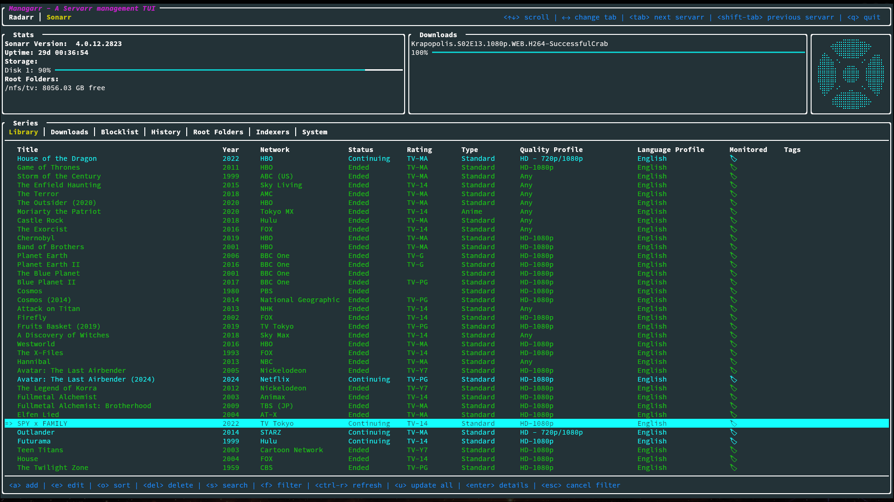

# Managarr Themes
The Managarr TUI can be customized to look how you like with various themes.

There are a few themes included by default with Managarr and are added to your `themes.yml`
on first startup. You can simply add more custom themes as you wish to this file.

## Table of Contents
- [Built In Themes](#built-in-themes)
- [Creating a Custom Theme](#creating-a-custom-theme)

## Built-In Themes
Managarr ships with a handful of built-in themes that you can either use or base your own
custom theme off of. The following themes are included by default:

### [Default](./default/README.md)


### [Dracula](./dracula/README.md)


### [Eldritch](./eldritch/README.md)


### [Watermelon Dark](./watermelon-dark/README.md)


## Creating a Custom Theme
To create a custom theme, you will need to add a new entry to the `themes.yml` file. If you decide not to add it to the
`themes.yml` file, you can also specify a different file to load themes from using the `--themes-file` argument.

Themes are customizable using hex color codes for the various elements of the TUI. The following
is an example that shows every available customization option for a custom theme:

```yaml
- name: my-theme
  theme:
    background:
      # Disable for transparent backgrounds
      enabled: true
      # Color of the full system background
      color: "#233237"
    awaiting_import:
      # Color for items awaiting import
      color: "#FFAA42"
    indeterminate:
      # Color for when item status is unknown
      color: "#FFAA42"
    default:
      # Default color for text and uncolored elements
      color: "#FFFFFF"
    downloaded:
      # Color for downloaded items (when monitored)
      color: "#00FF00"
    downloading:
      # Color for items currently downloading
      color: "#762671"
    failure:
      # Color for errors, no seeders, disabled indexers, 
      # failed indexer test results, etc.
      color: "#DE382B"
    help:
      # Color for help text like hotkeys and tooltips
      color: "#00FFFF"
    missing:
      # Color for missing items
      color: "#DE382B"
    primary:
      # Primary color for table/list items (without custom coloring), 
      # selected UI elements (e.g. table/list items, current tab, etc.), 
      # gauge bars, etc.
      color: "#2CB5E9"
    secondary:
      # Color for selected tabs, Warn log events, Paragraph headers (e.g. "Name: "),
      # and uncolored Message box contents
      color: "#FFC706"
    success:
      # Color for downloaded and imported and available items, 
      # good peer styling (more seeders than leechers), 
      # passing indexer test results, and enabled indexers
      color: "#39B54A"
    system_function:
      # Color for system functions like selected UI elements (e.g. checkboxes, yes/no prompts),
      # or loading spinner
      color: "#FFC706"
    unmonitored:
      # Color for unmonitored items
      color: "#808080"
    unmonitored_missing:
      # Color for unmonitored items that are also missing
      color: "#FFC706"
    unreleased:
      # Color for unreleased items
      color: "#00FFFF"
    warning:
      # Color for fewer seeders than leechers
      color: "#FF00FF"
```

**Note:** Bear in mind that while some colors may currently affect few UI elements, Managarr is still being built
and thus these colors may affect more elements in the future.

In order to activate your custom theme, you can either update your `config.yml`:

```yaml
theme: my-theme
radarr:
  ...
sonarr:
  ...
```

Or you can test out your theme via the `--theme` flag on the CLI:

```shell
managarr --theme my-theme
```

If you're developing your own theme and don't want to add it to the main `themes.yml` file, you can
also use the `--themes-file` argument to specify a different file to load themes from:

```shell
managarr --themes-file /path/to/my/testing-themes.yml
```