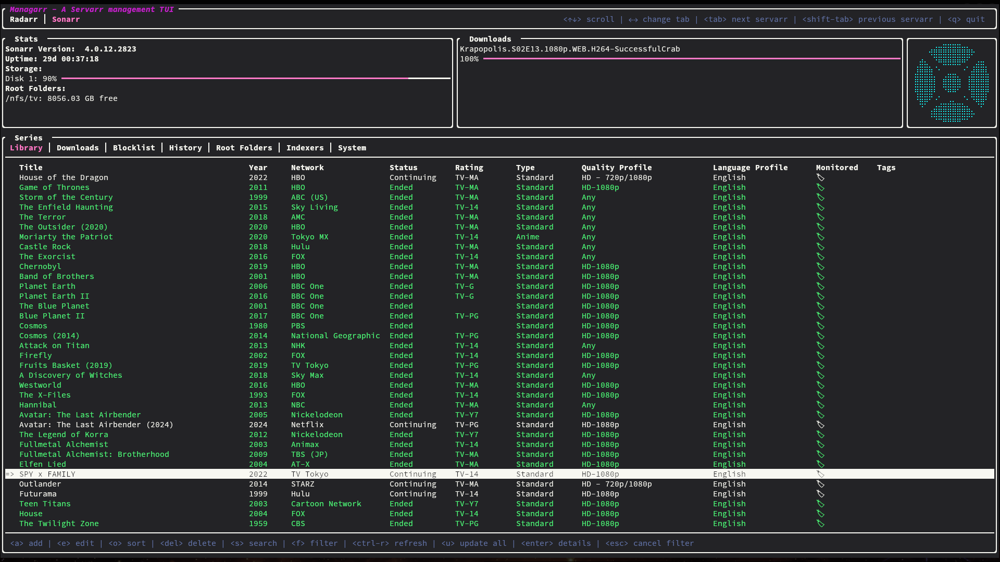
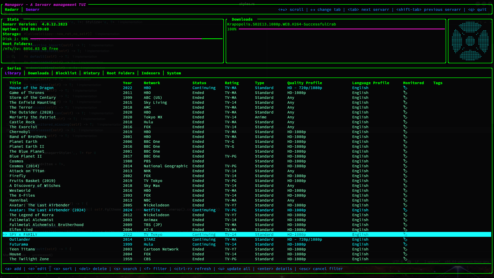

# Managarr Themes
The Managarr TUI can be customized to look how you like with various themes.

There are a few themes included by default with Managarr and are added to your `themes.yml`
on first startup. You can simply add more custom themes as you wish to this file.

## Table of Contents
- [Built In Themes](#built-in-themes)
- [Creating a Custom Theme](#creating-a-custom-theme)

## Built-In Themes
Managarr ships with a handful of built-in themes that you can either use or base your own
custom theme off of. The following themes are included by default:

### [Default](./default/README.md)


### [Dracula](./dracula/README.md)


### [Watermelon Dark](./watermelon-dark/README.md)


## Creating a Custom Theme
To create a custom theme, you will need to add a new entry to the `themes.yml` file. If you decide not to add it to the
`themes.yml` file, you can also specify a different file to load themes from using the `--themes-file` argument.

Themes are customizable using hex color codes for the various elements of the TUI. The following
is an example that shows every available customization option for a custom theme:

```yaml
- name: my-theme
  theme:
    background:
      enabled: true # Disable for transparent backgrounds
      color: "#233237"
    awaiting_import:
      color: "#FFAA42"
    indeterminate:
      color: "#FFAA42"
    default:
      color: "#FFFFFF"
    downloaded:
      color: "#00FF00"
    downloading:
      color: "#762671"
    failure:
      color: "#DE382B"
    help:
      color: "#00FFFF"
    missing:
      color: "#DE382B"
    primary:
      color: "#2CB5E9"
    secondary:
      color: "#FFC706"
    success:
      color: "#39B54A"
    system_function:
      color: "#FFC706"
    unmonitored:
      color: "#808080"
    unmonitored_missing:
      color: "#FFC706"
    unreleased:
      color: "#00FFFF"
    warning:
      color: "#FF00FF"
```

In order to activate your custom theme, you can either update your `config.yml`:

```yaml
theme: my-theme
radarr:
  ...
sonarr:
  ...
```

Or you can test out your theme via the `--theme` flag on the CLI:

```shell
managarr --theme my-theme
```

If you're developing your own theme and don't want to add it to the main `themes.yml` file, you can
also use the `--themes-file` argument to specify a different file to load themes from:

```shell
managarr --themes-file /path/to/my/testing-themes.yml
```